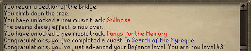

## OSRS Screenshot Transcriber

This is a simple application which can transcribe text from Old School RuneScape chat screenshots.

### Usage

`RSImageTranscriber <screenshot name> <output text file>`

The output text file is optional. If not specified the contents of the screenshot will be dumped to the console.

### Example

Screenshot:



Transcribed:
```
You repair a section of the bridge.
You climb down the tree.
You have unlocked a new music track: Stillness
The swamp decay effect is now over.
You have unlocked a new music track: Fangs for the Memory
Congratulations you've completed a quest: In Search of the Myreque
Congratulations you've just advanced your Defence level. You are now level 43.
```

### Purpose

I wrote this to make searching through old screenshots easier. For example, you can run this application on a
directory of screenshots to transcribe and embed the chat text into the image metadata for an easier search
experience. Or if you have a screenshot containing a lot of text you can convert the entire thing to a text
file in seconds.

### Requirements

- Java 8
- Kotlin (for compilation)